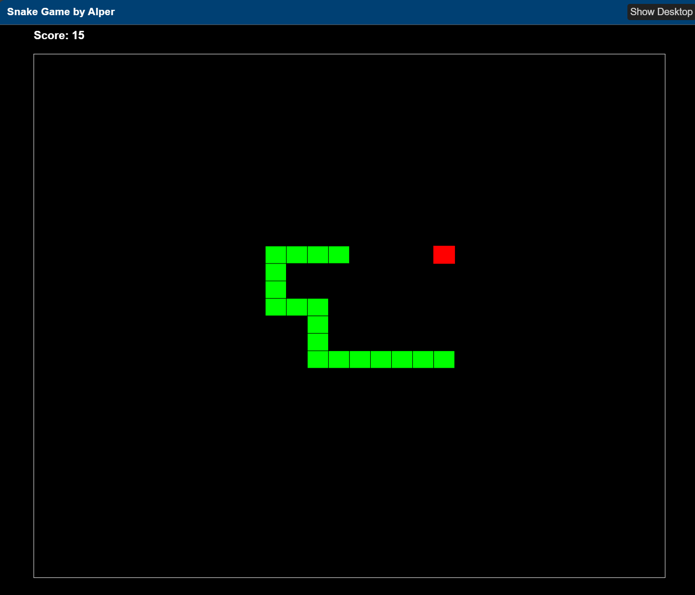

# MATLAB Snake Game

A simple, classic Snake game implemented entirely in MATLAB. Control a growing snake on a 30×30 grid, eat red food blocks to score points, and avoid colliding with yourself as you wrap around the edges.

## In-game Screenshot

## Features
- **Grid-based gameplay** on a 30×30 board  
- **W A S D controls** for smooth, real-time directional input  
- **Red food blocks** that spawn randomly; each one eaten increases your length and score  
- **Screen-wrapped movement**: exiting one edge of the grid reappears on the opposite side  
- **Collision detection**: game ends immediately if your head runs into any part of your body  
- **Live score display** above the playing field  
- **Modal dialogs** for welcome instructions and “Game Over” messages  

## Known Issue
- There’s a bug that allows a rapid 180° turn and immediate self-collision at the second segment.  
  *Reproduce by moving right and quickly pressing S then A before the next frame.*
